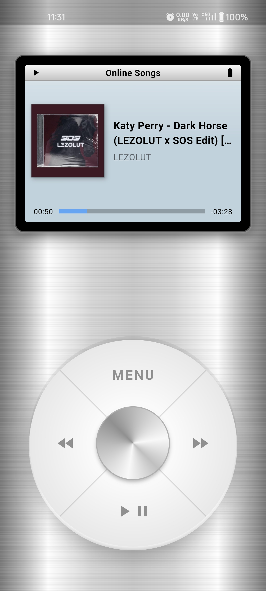
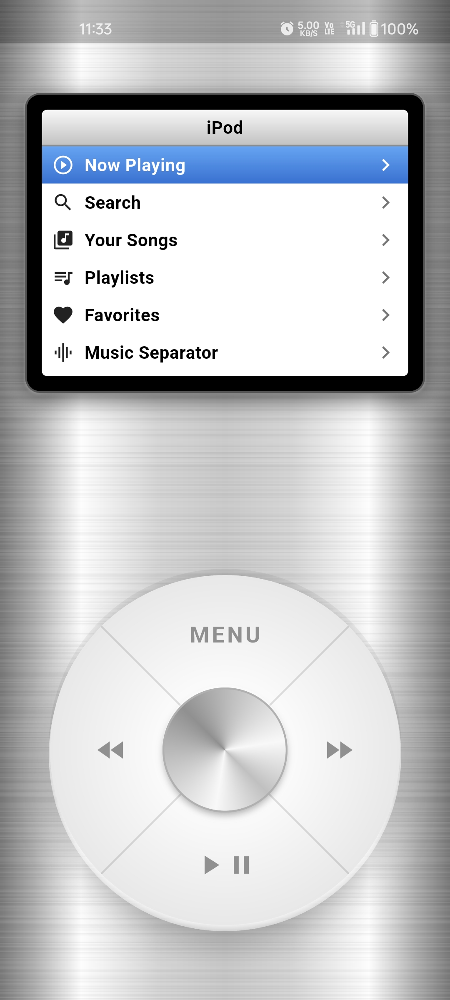
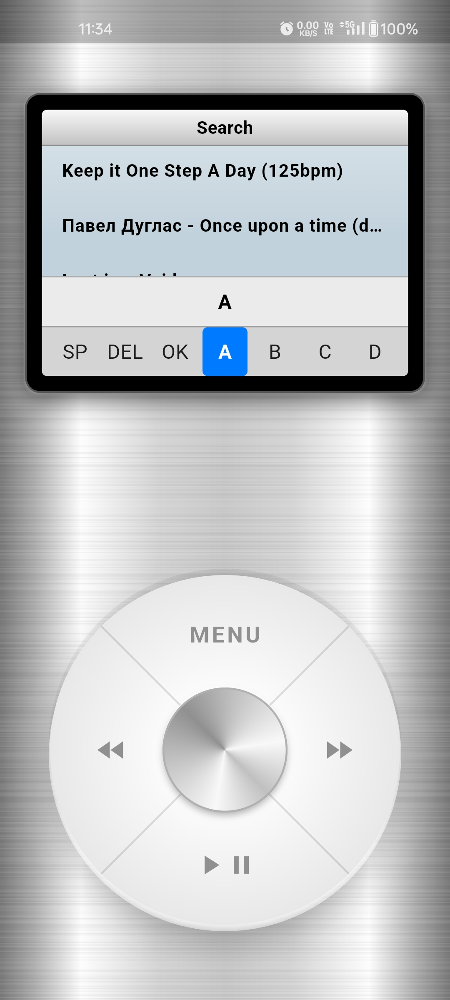
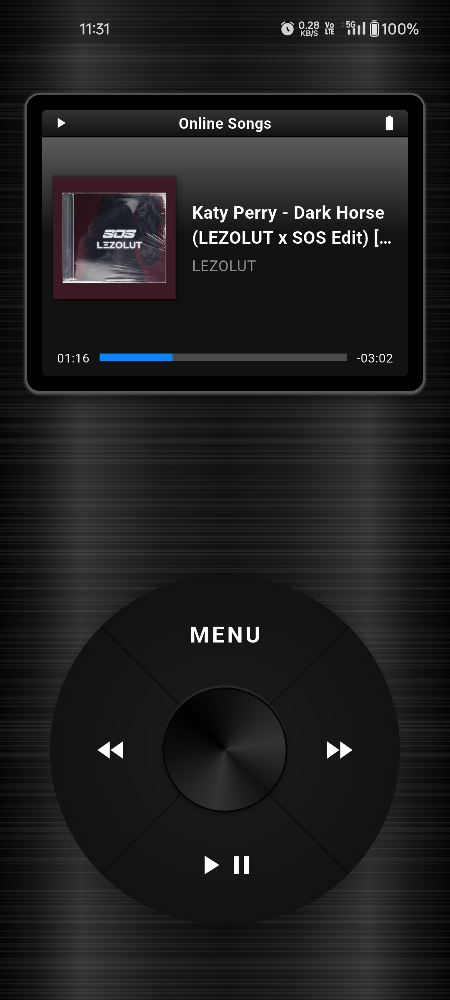
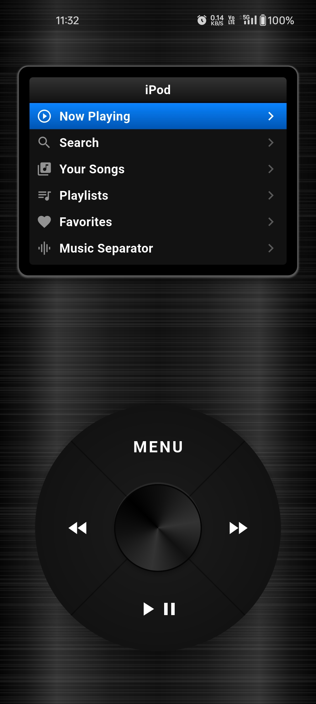
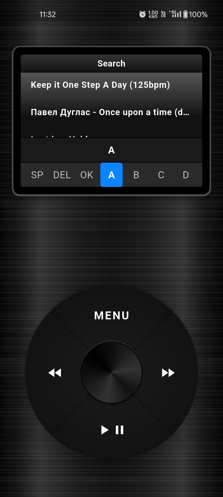

<p align="center">
  
</p>

# 🎵 Retro Music Player & AI Separator

Welcome to the **Retro Music Player & AI Separator**! This is a full-stack project that marries a nostalgic, iPod-classic-inspired music player interface with cutting-edge AI technologies for audio separation.

Whether you want to stream trending tracks, manage your local music library, or isolate the vocals and instruments from your favorite songs, this application has you covered.

---

## 🌟 Key Features

### 📱 The Nostalgic Player (Frontend)
Experience music through a beautifully crafted, retro-style interface built with Flutter.
- **Classic Wheel Navigation**: Scroll through menus and seek tracks using a nostalgic, circular scroll-wheel interface with haptic feedback.
- **Online Streaming**: Integrated with the [Audius API](https://audius.co/) to fetch and stream trending tracks directly from the decentralized network.
- **Local Music Support**: Seamlessly browse and play audio files stored locally on your device.
- **Playlists & Favorites**: Create custom playlists, favorite your top tracks, and manage your library easily.
- **Dark & Light Modes**: Switch between themes for the perfect viewing experience in any lighting.

### 🎛️ The AI Separator (Backend & Cloud)
Harness the power of machine learning to deconstruct your music.
- **Stem Separation with Demucs**: Upload a song from your device and separate it into two high-quality stems using [Demucs (HTDemucs model)](https://github.com/facebookresearch/demucs).
  - **Vocals**
  - **Accompaniment (Music)**
- **Cloud Processing via Hugging Face**: The heavy lifting is handled by a FastAPI backend deployed on Hugging Face Spaces, ensuring your mobile device stays fast and responsive.
- **Interactive Studio Mixer**: Once separated, listen to the individual stems directly in the app. You can independently adjust the volume of the vocals and the music, and even download the stems directly to your device.

---

## 📸 Screenshots

Here is a glimpse of the beautifully crafted iPod-style interface in both Light and Dark themes.

### Light Mode
<p float="left">
   
  
  
</p>

### Dark Mode
<p float="left">
  
  
  
</p>

---

## 🛠️ Tech Stack

**Frontend (Mobile)**
- [Flutter](https://flutter.dev/) & Dart
- `just_audio` for robust audio playback
- `on_audio_query` for local file querying

**Backend (Audio Processing API)**
- [Python 3](https://www.python.org/) & [FastAPI](https://fastapi.tiangolo.com/)
- [Demucs](https://github.com/facebookresearch/demucs) for state-of-the-art music source separation
- Hosted on Hugging Face Spaces

---

## 📁 Project Structure

```plaintext
music_separator_project/
├── backend_app_folder/          # Python/FastAPI server (Demucs)
│   ├── main.py                  # API endpoints and separation logic
│   ├── requirements.txt         # Backend dependencies
│   ├── uploads/                 # Temporary storage for uploads
│   └── output/                  # Output directory for Demucs
│
├── flutter_app_folder/          # Flutter UI
│   ├── lib/
│   │   ├── screens/             # UI screens (Home, Separator, Playlists, etc.)
│   │   ├── services/            # Audius API & Backend communication
│   │   └── main.dart            # App entry point
│   └── pubspec.yaml             # Frontend dependencies
│
└── README.md                    # Project documentation
```

---

## 🚀 Getting Started

### 1. Backend Setup (Local Testing)
The app is configured to hit the Hugging Face Space by default, but you can run the backend locally if you wish:

```bash
cd backend_app_folder

# Create and activate virtual environment
python -m venv venv
# On Windows:
venv\Scripts\activate
# On macOS/Linux:
source venv/bin/activate

# Install dependencies
pip install -r requirements.txt
```

> **Note**: You must have `ffmpeg` installed and added to your system's PATH for Demucs to work.

Run the FastAPI server:
```bash
uvicorn main:app --reload
```
The server will run on `http://localhost:8000`.

### 2. Frontend Setup (Flutter Player)

Ensure you have [Flutter](https://docs.flutter.dev/get-started/install) installed.

```bash
cd flutter_app_folder

# Fetch dependencies
flutter pub get

# Run the app (ensure you have an emulator running or device connected)
flutter run
```

---

## 📡 Backend API Reference

**POST `/upload`**
Uploads a song and begins the Demucs 2-stem separation process.

| Field | Type   | Description                                     |
|-------|--------|-------------------------------------------------|
| file  | File   | Audio file to process                           |

**GET `/status/{task_id}`**
Checks the status/progress of the separation task.

**GET `/download/{task_id}/{stem}`**
Downloads the completed stem (valid stems: `vocals`, `accompaniment`).

---

## 👨‍💻 Author

**Rohith Rajesh K**  
GitHub: [@rohu069](https://github.com/rohu069)

## 📜 License

This project is open-source and available under the MIT License. Feel free to fork, modify, and use it in your own projects!
